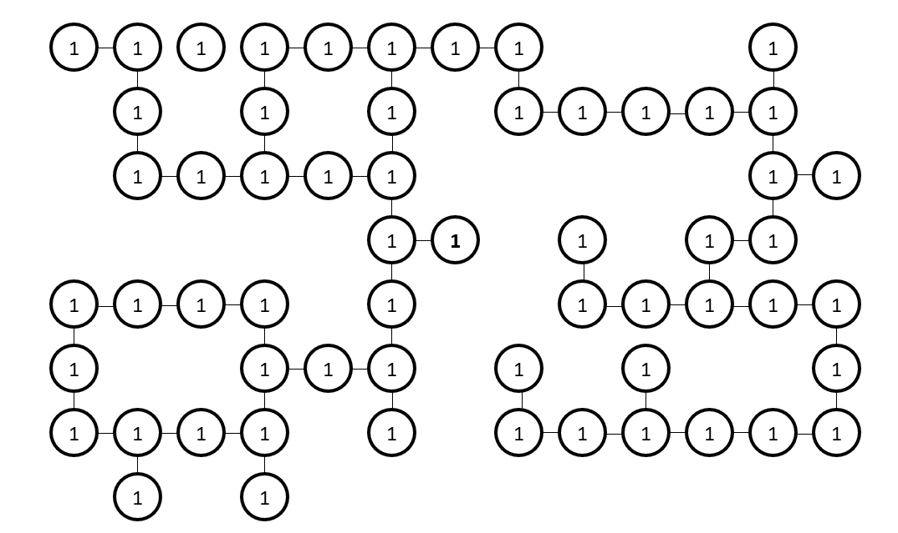
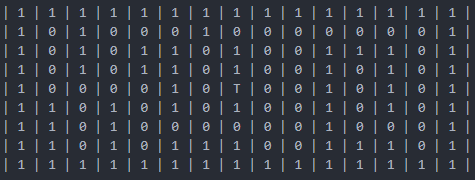
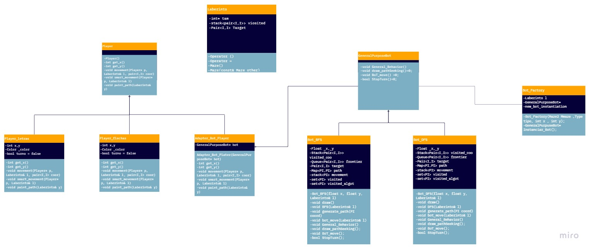

<a name="readme-top"></a>

<div align="center">
  <a href="https://github.com/CS1103/proyecto-final-2023_0-proyecto-final-2023_0-grupo-5">
    
  </a>
  <h1>👾 MAZERS Ver. 1.0 👾</h1>
  
  <p>
  Este proyecto ha sido desarrollado por estudiantes del curso de Programación 3
de la Universidad de Ingeniería y Tecnología 💙🤍. Esperemos les guste. 🎮
    
  </p>
</div>

<details open>
  <summary>Índice:</summary>
  <ol>
    <li><a href="#acerca-del-proyecto">
      Acerca del proyecto
      <ul>
        <li><a href="#descripción">Descripción</a></li>
        <li><a href="#características">Características</a></li>
        <li><a href="#tecnologías">Tecnologías</a></li>
        <li><a href="#temas-de-interés">Temas de interés</a></li>
        <li><a href="#algoritmos-y-contenedores-utilizados">Algoritmos y contenedores utilizados</a></li>
      </ul>
    </a></li>
    <li><a href="#instalación">
      Instalación
      <ul>
        <li><a href="#requisitos">Requisitos</a></li>
        <li><a href="#pasos-de-instalación">Pasos de instalación</a></li>
      </ul>
    </a></li>
    <li><a href="#instrucciones-de-uso">
      Instrucciones de uso
    </a></li>
    <li><a href="#licencia">
      Licencia
    </a></li>
    <li><a href="#diagramas">
      Diagramas
      <ul>
        <li><a href="#grafo de un tablero cualquiera (tamaño m x n)">Grafo de un tablero cualquiera (tamaño m x n)</a></li>
        <li><a href="#diagrama-de-clases">Diagrama de clases</a></li>
      </ul>
    </a></li>
    <li><a href="#link-del-video">
      Link del video
    </a></li>
    <li><a href="#autores">
      Autores
    </a></li>
    <li><a href="#referencias">
      Referencias
    </a></li>
  </ol>
</details>

---

## Acerca del proyecto

### Descripción

Este proyecto consiste en el desarrollo del mítico juego del laberinto, con varios
añadidos extra e implementaciones que se adaptan a ofrecer la mejor
experiencia de juego posible. Este juego tiene como objetivo ofrecer posibilidades
infinitas a la hora de jugar, ya que ningun juego será igual que el anterior, además
de poder configurar algunos aspectos del juego antes de empezar para mejorar la
experiencia. No obstante, el juego también permite decidir la forma de jugar, ya sea
entre un jugador de manera local, u contra la misma computadora.

### Características

#### Características Principales

- **Orden de juego:**

  El juego comienza con la elección de un turno al azar, dependiendo de ello un jugador u otro tiene la posibilidad de realizar cualquier movimiento dentro del laberinto, mientras que el otro solo espera y el juego no ejecuta ninguna acción extra mientras esto ocurre.

- **Asignación del ganador:**

  El primer jugador que llegue a la meta se declara ganador, y el juego muestra en pantalla el nombre del jugador ganador.

- **Partidas sin limites:**

  Cada juego es único y diferente, por lo que no habrán 2 laberintos iguales que puedas jugar. Siempre son distintos.

#### Caracteristicas Adicionales

- Implementación de la jugabilidad multijugador desde un mismo dispositivo (local).
- Selector de diferentes dificultades al jugar contra un bot (computadora).
- Gráficos, musica, y diferente contenido multimedia para mejorar la experiencia de juego.
- Posicionamiento adaptable de los elementos del juego de acuerdo al tamaño de la pantalla.

### Tecnologías

- Lenguaje de programación C++20 o posterior
- Librería Raylib para el manejo de gráficos para Windows en C++

### Temas de interés

- Backtracking algorithm to generate random mazes
- Deep-First Search to find the path in the maze
- Breadth-First Search to find the shortest path in the maze
- Using Raylib library to create games with C++

### Algoritmos y contenedores utilizados

- **BFS (Breadth First Search):**

  Una búsqueda en anchura (BFS) es un algoritmo que se utiliza para buscar y recorrer nodos en un grafo o árbol, empezando por el nodo raíz y explorando primero los nodos vecinos en el mismo nivel antes de pasar a los nodos del siguiente nivel. Se implementa utilizando una cola para almacenar los nodos que se van explorando en cada nivel y es eficiente para encontrar el camino más corto entre dos nodos (Geeks For Geeks, 2023).

<div align="center">

</div>

- **DFS (Deep First Search):**

  Una búsqueda en profundidad (DFS) es un algoritmo que se utiliza para recorrer y buscar nodos en un grafo o árbol, explorando un camino hasta que se alcance un nodo sin hijos, para después regresar y explorar otro camino. Se comienza por el nodo raíz y se explora a profundidad antes de regresar a explorar otros caminos. El DFS puede implementarse mediante recursión o utilizando una pila para almacenar los nodos a explorar (Li & Ueno, 2017).

<div align="center">

</div>

- **Backtracking:**

  Backtracking, también conocido como "vuelta atrás", es un algoritmo que se utiliza para resolver problemas de decisión en los que es necesario buscar todas las posibles soluciones. Comienza con una solución parcial y avanza iterativamente intentando agregar elementos adicionales, hasta encontrar una solución completa o descubrir que no hay solución. Si se llega a un callejón sin salida, se regresa a la solución anterior y se intenta otra opción. El backtracking puede ser implementado mediante recursión o utilizando una pila para almacenar las soluciones parciales (Subham, 2022).

<div align="center">

</div>

- **Stack:**

  Un stack (pila) es una estructura de datos que se utiliza en programación para almacenar y acceder a elementos de manera ordenada, siguiendo el principio de "último en entrar, primero en salir" (LIFO). Es decir, el último elemento añadido a la pila es el primero en ser eliminado. Las operaciones fundamentales de una pila son "push" (añadir un elemento al final) y "pop" (eliminar el último elemento añadido). Las pilas se utilizan en diversas aplicaciones, como el manejo de llamadas en una función recursiva, el uso del historial en un navegador web, entre otros (Thompson, 2023).

<div align="center">

</div>

- **Queue:**

  Una queue (cola) es una estructura de datos en programación que se utiliza para almacenar y acceder a elementos de manera ordenada, siguiendo el principio de "primero en entrar, primero en salir" (FIFO). Es decir, el primer elemento añadido a la cola es el primero en ser eliminado. Las operaciones fundamentales de una cola son "enqueue" (añadir un elemento al final) y "dequeue" (eliminar el primer elemento añadido). Las colas se utilizan en diversas aplicaciones, como en la impresión de documentos, el manejo de mensajes en una red de comunicación, entre otros (Welch, 2020).

<div align="center">

</div>

## Instalación

### Requisitos

- Shell compatible
- Compilador gnu++2a o posterior
- Administrador de paquetes CMake v.3 o posterior
- Libreria Raylib (Se instala de manera automática al compilar).

### Pasos de instalación

1. Clonación de repositorio usando git en un shell compatible

```bash
git clone https://github.com/CS1103/proyecto-final-grupo-5-1
```

2. Compilación del proyecto con el siguiente comando de CMake

```bash
mkdir build && cd build && cmake .. && make
```

## Instrucciones de uso

### Instrucciones

### Reglas de juego

El juego MAZERS genera un laberinto de tamaño (n x m), y a partir de aquí se puede hacer lo siguiete:

- Al comienzo de cada partida se genera un laberinto con recuadros llenos o vacios (paredes y espacios para moverse).
- Cada jugador cuenta con un indicador cuadrado de un color distinto al otro. (Siempre son 2 jugadores)
- Los movimientos se harán por turnos de manera consecutiva, donde es posible moverse en cualquier dirección siempre y cuando haya un recuadro de espacio disponible como mínimo.
- El movimiento se hace hasta encontrar una bifurcación (2 o más caminos disponibles). Siempre se avanza todas las casillas disponibles hasta que haya varios caminos, o no haya caminos disponibles y solo se pueda regresar al punto de control de donde se realizó el movimiento.
- La finalidad del juego es llegar a la meta (el centro de laberinto) antes que el otro jugador.
- Gana el jugador que llegue primero al centro del laberinto (objetivo).

## Licencia

Distribuido bajo la licencia GNU. Ver [`LICENCE`](LICENCE) para más información.

## Diagramas

### Grafo de un tablero cualquiera (tamaño m x n)
<div align="center">  </div>
<br>

- Podemos observar que cada nodo del grafo se representa con un "1", representando el camino que se ha creado dentro del laberinto hasta el objetivo (centro).
- Se cumple que hay 2 nodos principales que marcan el inicio de ambos jugadores, con un nodo objetivo que esta en el centro.
- La posibilidad de existencia de bucles es alta, sin embargo, se puede recorrer cualquier nodo en cualquier dirección, siempre y cuando este tenga un "1".

Si quisieramos utilizar una matriz para representar el laberinto, estas serian las relaciónes por casillas en un tablero de  **15 x 9**. Donde T marca el objetivo siempre en el medio,
los "1" son las casillas por donde se puede mover, y los "0" son paredes.

<div align="center">  </div>

### Diagrama de clases



## Link del video

[https://www.youtube.com/watch?v=pfzdqTRV0DI&ab_channel=MUSIC4MIND](https://www.youtube.com/watch?v=pfzdqTRV0DI&ab_channel=MUSIC4MIND)

## Autores

- Benjamin Soto Mayta
- Fabricio Chavez Balarezo
- Fabrizzio Vilchez Espinoza
- Jesus Egusquiza Ore
- Sebastian Rodriguez Herrera
- Rodrigo León Chumpitaz

## Referencias

-GeeksForGeeks. (21 de febrero del 2023). _Breadth First Search or BFS for a Graph_. Geeks for Geeks. Recuperado el 22 de febrero del 2023 de [https://www.geeksforgeeks.org/breadth-first-search-or-bfs-for-a-graph/](https://www.geeksforgeeks.org/breadth-first-search-or-bfs-for-a-graph/)
<br>
<br>
-Li, C., & Ueno, M. (2017). _An extended depth-first search algorithm for optimal triangulation of Bayesian networks_. International Journal of Approximate Reasoning, 80, 294–312. doi:10.1016/j.ijar.2016.09.012
<br>
<br>
-Subham, D. (11 de noviembre del 2022). _Backtracking Algorithms_. Baeldung. [https://www.baeldung.com/cs/backtracking-algorithms](https://www.baeldung.com/cs/backtracking-algorithms)
<br>
<br>
-Thompson, B. (14 de enero del 2023). _Stack in C++ STL with Example_. Guru99. [https://www.guru99.com/stack-in-cpp-stl.html](https://www.guru99.com/stack-in-cpp-stl.html)
<br>
<br>
-Welch, S. (25 de marzo del 2020). _C++ Queues Explained_. Udacity. [https://www.udacity.com/blog/2020/03/c-queues-explained.html](https://www.udacity.com/blog/2020/03/c-queues-explained.html)